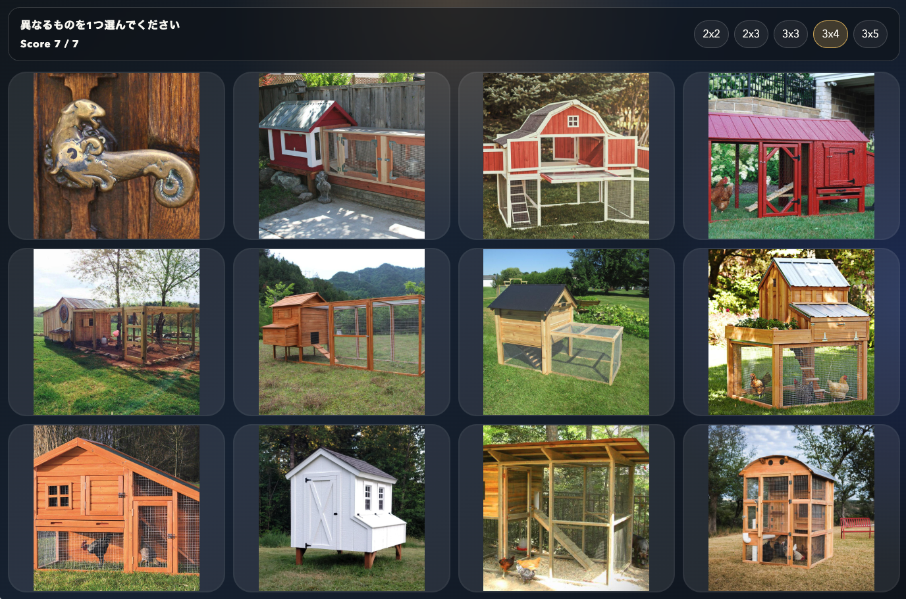

# Odd One Out

React + Vite + TypeScript で実装した、複数の画像の中から 1 つだけ異なるものを選ぶアプリケーションです。



## 概要

- `object_images/` 配下の画像カテゴリから、ある 1 フォルダから `表示枚数 - 1` 枚、別の 1 フォルダから 1 枚をランダムに選択します。
- 表示レイアウトは `2x2`、`2x3`、`3x3`、`3x4`、`3x5` から切り替えできます。
- `distance/output/category_similarity.json` を基に、共通カテゴリと odd カテゴリの距離レンジを `0.00` から `1.00` の範囲で指定できます。
- 画像はカード内に全体が収まるように表示されます。
- 異なる画像をクリックすると正誤判定を行い、短い表示のあと次の問題に進みます。
- 次の問題で使う画像は事前に先読みし、切り替え時のラグがなるべく少なくなるようにしています。
## 必要なデータ

このアプリを使用するには、画像データセットが必要です。

`image_THINGS.zip` を以下からダウンロードする必要があります:

<https://osf.io/jum2f/files/osfstorage>

ダウンロードした zip を展開し、このリポジトリ直下で `object_images/` ディレクトリが存在する状態にしてください。

想定構成:

```text
OddOneOut/
  distance/
    output/
      category_similarity.json
  object_images/
    apple/
    airplane/
    ...
  src/
  package.json
```

## セットアップ

```bash
npm install
```

## 開発サーバー起動

```bash
npm run dev
```

## ビルド

```bash
npm run build
```

## 補足

- 画像数が非常に多いため、初回起動やビルドには少し時間がかかることがあります。
- レイアウトによっては、同一カテゴリ側に多くの画像枚数が必要です。たとえば `3x5` では 14 枚以上の画像を含むカテゴリが必要です。
- 距離レンジ機能は `distance/output/category_similarity.json` と `distance/concepts-metadata_things.tsv` を参照します。
- `object_images/` が存在しない、または想定外の構成になっている場合、アプリは正常に動作しません。
